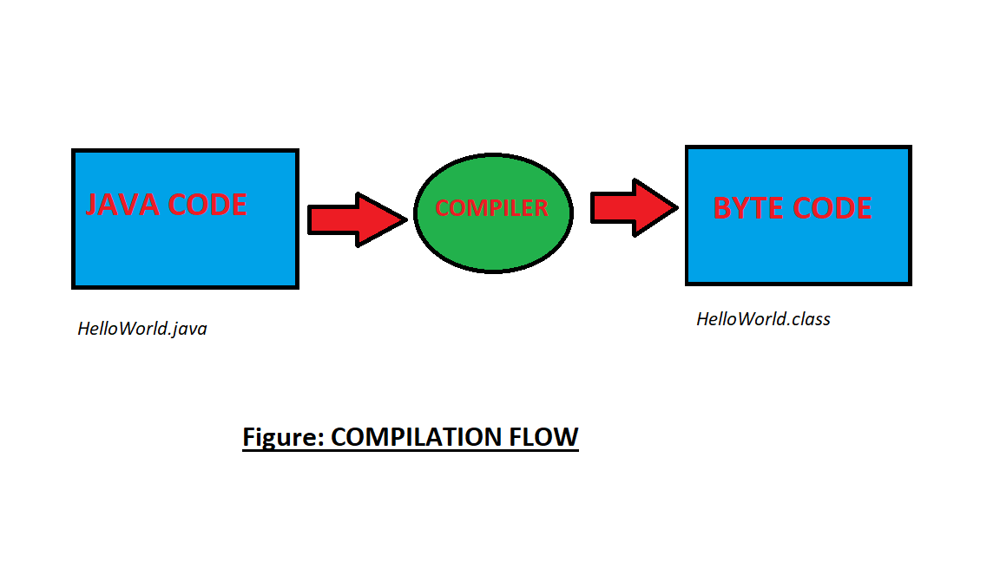

> # FIRST JAVA PROGRAM

__CODE:__
```java
class HelloWorld{

    public static void main(String args[]){

     System.out.println("Hello Java"); 

    } 
     
}
```

__OUTPUT:__
```java
Hello Java
```

__Note:__
    
When we compile Java program using javac tool, Java compiler converts the *source code* into *byte code*.




