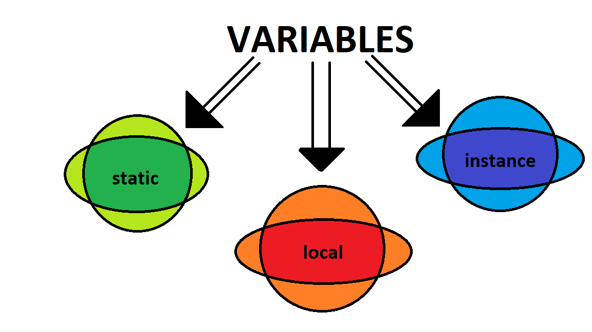

> # VARIABLES IN JAVA
A *variable* is a name given to a memory location.The value stored in a variable can be changed during program execution.All the operations done on the variable effects that memory location.
In Java, all the variables must be declared before use.


> ## Types Of Variables In Java.


There are three types of variables in java.They are:

* Local Variables 
* Instance Variables
* Static Variables


> ### Local Variables:  
A variable defined within a block or method or constructor is called *local variable*.The scope of local variables exists only within the block in which the variable is declared.


> ### Instance Variables:
A variable defines within a class outside any method, constructor or block is called instance variable.Instance variables are created when an object of the class is created and destroyed when the object is destroyed.


> ### Static Variables:
A variable defined within a class whose behaviour is static in nature is called static variable.Static variables are created at the start of program execution and destroyed automatically when execution ends.




> ## Simple Program:
```java
public class Variables{
    
    // instance variables
    int num1 = "100" ;
    char letter = 'A';

    // static variables
    public static int num2 = "200" ;
    public static String name = "Ram" ;

    public void localVar{

        // local variables
        int num4 = "400" ;
        float marks = "40.5F" ;

    }

    public static void main(String[] args){

        Variables obj = new Variables();
        obj.localVar();
        
        // local variables
        int num3 = "300" ;
        double salary = "100000" ;
    }
}
```