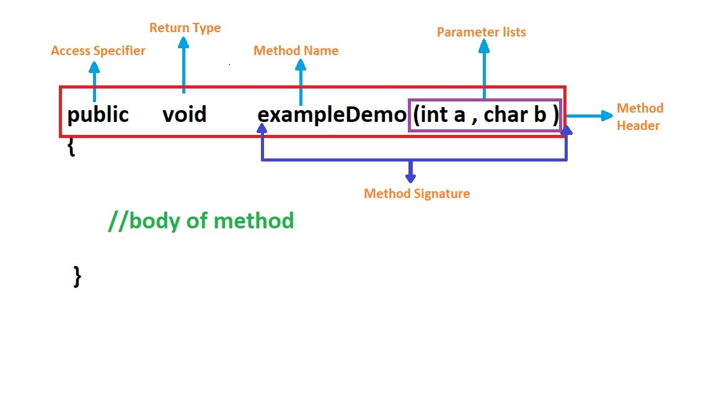

> # Method in Java :
A __Method__ is a block of code that perform a certain task or operation. It provides reusability ,easy modification and readability of code.

The `main()` method is the starting point for JVM to start excecution of a Java program.Without the main() method,JVM willnot execute the program.

__Syntax:__
```java
public static void main(String[] args){
    
    // body of main() method

}
```
The main() method can be overloaded.We can define any number of main() method in the class, but the method signature must be different.

> ## Method Declaration


Method Declaration includes the following components:

1. __Access Specifier(Modifier):__

    It specifies the visibility of the method. Java provides four types of access specifier:

    - __Public:__ \
        
        The method is accessible by all classes when we use public specifier in our application.

    - __Private:__ 
        
        When we use a private access specifier, the method is accessible only in the classes in which it is defined.

    - __Protected:__ 
    
        When we use protected access specifier, the method is accessible within the same package or subclasses in a different package.

    - __Default:__ 
    
        When we do not use any access specifier in the method declaration, Java uses default access specifier by default. It is visible only from the same package only.

2. __Return Type:__
    
     Return type is a data type that the method returns. It may have a primitive data type, object, collection, void, etc. If the method does not return anything, we use void keyword.

3. __Method Signature:__ 
    
    It includes the method name and parameter list.
    
    - __Method Name:__ 
    
        It is a unique name that is used to define the name of a method.

    - __Parameter List:__ 
        
        It is the list of parameters separated by a comma and enclosed in the pair of parentheses.

> ## Types of Method
There are two types of methods in Java:

1. __Predefined Method:__

    Predefined methods are the method that is already defined in the class libraries. It is also known as the standard *library method* or *built-in method*. We can directly use these methods just by calling them in the program at any point.When we call any of the predefined methods in our program, a series of codes related to the corresponding method runs in the background that is already stored in the library.

2. __User-defined Method:__

    The method written by the user or programmer is known as a user-defined method.

On the basis of keyword ,there are Four types of method in Java:
1. __Static Method:__
    A method that has static keyword is known as static method.The main advantage of a static method is that we can call it without creating an object.

2. __Instance Method:__
    The method of the class is known as an instance method.Before calling the instance method, it is necessary to create an object of its class.There are two types of Instance Method.They are:

    - __Accessor Method:__ 
    
        The method that reads the instance variable is known as the Accessor Method. We can easily identify it because the method is prefixed with the word get. It is also known as getters. It is used to get the value of the private field.

    - __Mutator Method:__ 
        
        The method that reads the instance variable and also modify the values is known as Mutator Method. We can easily identify it because the method is prefixed with the word set. It is also known as setters or modifiers. It does not return anything. It is used to set the value of the private field.


3. __Abstract Method:__

    The method that does not has method body and has abstract keyword is known as abstract method. It always declares in the abstract class *(i.e class itself must be abstract if it has abstract method).*

4. __Factory Method:__

    It is a method that returns an object to the class to which it belongs. All static methods are factory methods. For example, NumberFormat obj = NumberFormat.getNumberInstance();


