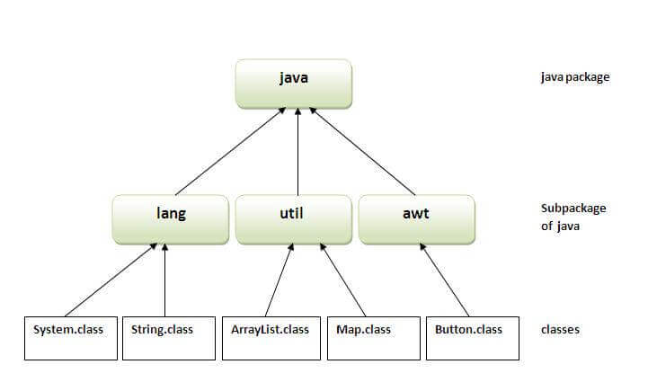

> # PACKAGES IN JAVA

A **Java Package** is a group of similar types of classes, interfaces and sub-packages.It is used to categorize the classes and interfaces so that they can be easily maintained.Java package provides access protection and removes naming collision.

Package in java __can be categorized in two form:
* __Built-in package__ *such as java, lang, awt, javax, swing, net, io, util, sql etc.*
* __User-defined package__ *defined by user*

<!--IMAGES-->




**Package** keyword is used to create packages in java.
    
**Syntax:**
```java
package packagename;
```

**Compilation of Java package:**
```java
javac -d directory javafilename.java
// -d switch specifies the destination where to put the generated class file.
// You can use any directory name like -d  c:/folder (in case of windows) etc.If you want to keep the package within the same directory, you can use . (dot).
```

**Execution of Java package:**
```java
java packagename.javafilename
```

> ### Simple Program for Java Package:
```java
package fristpackage;
  
public class Example{  

public static void main(String args[]){  
    
    System.out.println("Welcome to Java package");

   }

} 

//save this java program as Example.java

```
> To Compile :  javac -d . Example.java

> To Run :  java firstpackage.Example

## How to access package from another package?
There are three ways to access the package from outside the package.They are:

* Using import package.* ;
* Using package.classname ;
* Using fully qualified name

> ### Using import package.* :

If you use __import package.*__ in a package then all the classes and interfaces of this package will be accessible *(except subpackages)* to another packages where you want to import.

__For Example:__
```java
//save by MethodOne.java  
package packageone;

public class MethodOne{  

public void message(){

    System.out.println("Hello World.");

    }  

}  
```
```java
//save by MethodTwo.java  
package packagetwo;  
import packageone.*;  
  
class MethodTwo{ 

  public static void main(String args[]){ 

   MethodOne obj = new MethodOne();  
   obj.message();

  } 

}  
```

> ### Using packagename.classname:
If you import package.classname then only declared class of this package will be accessible.
__For Example:__
```java
//save by MethodOne.java  
package packageone;

public class MethodOne{  

public void message(){

    System.out.println("Hello World.");

    }  

}  
```
```java
//save by MethodTwo.java  
package packagetwo;  
import packageone.MethodOne;  
  
class MethodTwo{ 

  public static void main(String args[]){ 

   MethodOne obj = new MethodOne();  
   obj.message();

  } 

}  
```

> ### Using fully qualified name:
If you use fully qualified name then only declared class of this package will be accessible. Now there is no need to import. But you need to use fully qualified name every time when you are accessing the class or interface.This is used generally when two packages has same class names.
__For Example:__
```java
//save by MethodOne.java  
package packageone;

public class MethodOne{  

public void message(){

    System.out.println("Hello World.");

    }  

}  
```
```java
//save by MethodTwo.java  
package packagetwo;   
  
class MethodTwo{ 

  public static void main(String args[]){ 

   packageone.MethodOne obj = new packageone.MethodOne();  
   obj.message();

  } 

}  
```