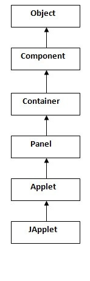

> #  Applet In Java:

* Applet is a special program that runs inside the browser and works at client side.
* An applet is a Java class that extends the *java.applet.Applet*.
* JVM is required to view an applet.

> ## Advantages Of Applet In Java:

* It works at client side so less response time.
* It is secured.
* It can be executed by any browsers.

> ## Types Of Applet:

* Based on Applet class

    These Applets use the Abstract Window Toolkit (AWT) to provide the graphical user interface (GUI).

* Based on JApplet class

    They are based on the Swing class JApplet which inherits Applet.Swing applet use the swing classes to provide the GUI.

> ## Hierarchy of Applet:

Here, **Applet** class extends **Panel** class where **Panel** class extends **Container** class which is the subclass of **Component** class.

