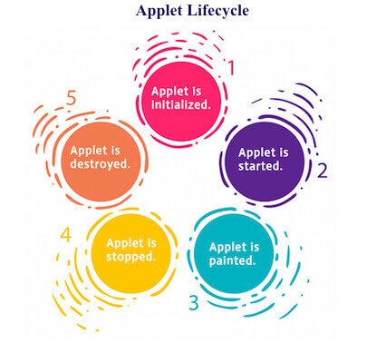

> # Life Cycle Of Applet:
The life cycle of Applet consits of following five stages where *java.applet.Applet* class 4 life cycle methods and *java.awt.Component* class provides 1 life cycle methods for an applet.
* Initialize
```java 
public void init()
// used to initialized the Applet
// It is invoked only once.
```
* Start
```java 
public void start()
// used to start the Applet
// It is invoked after the init() method or browser is maximized.
```
* Paint
```java 
public void paint(Graphics g)
// used to paint the Applet
// It provides Graphics class object that can be used for drawing oval, rectangle, arc etc.
```
* Stop
```java 
public void stop()
// used to stop the Applet
// It is invoked when Applet is stop or browser is minimized.
```
* Destroy
```java 
public void destroy()
// used to destroy the Applet
// It is invoked only once.
```




