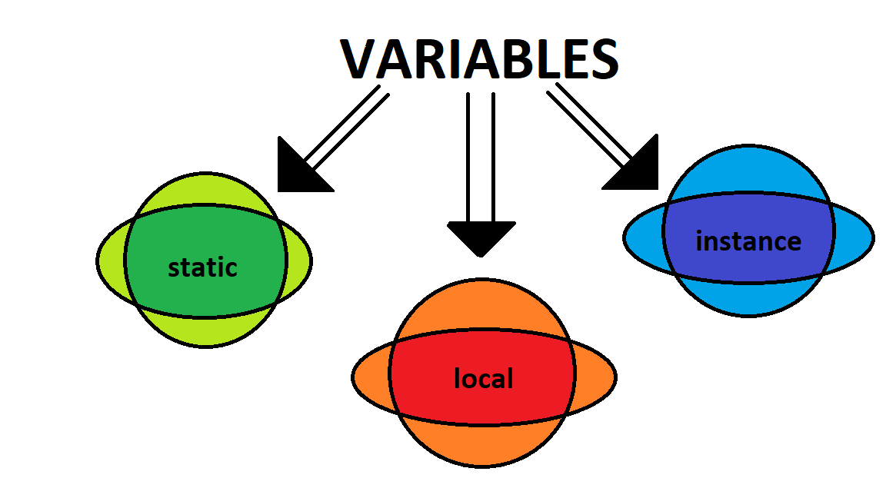

> # VARIABLES IN JAVA
A *variable* is a name given to a memory location.The value stored in a variable can be changed during program execution.All the operations done on the variable effects that memory location.
In Java, all the variables must be declared before use.


> ## Types Of Variables In Java.


There are three types of variables in java.They are:

* Local Variables 
* Instance Variables
* Static Variables


> ### Local Variables:  
A variable defined within a block or method or constructor is called *local variable*.The scope of local variables exists only within the block in which the variable is declared.


> ### Instance Variables:
A variable defines within a class outside any method, constructor or block is called instance variable.Instance variables are created when an object of the class is created and destroyed when the object is destroyed.

Instance variable doesn't get memory at compile time. It gets memory at runtime when an object or instance is created. That is why it is known as an instance variable.


> ### Static Variables:
A variable defined within a class whose behaviour is static in nature is called static variable.Static variables are created at the start of program execution and destroyed automatically when execution ends.




> ## Simple Program:
```java
public class Variables{
    
    // instance variables
    int num1 = "100" ;
    char letter = 'A';

    // static variables
    public static int num2 = "200" ;
    public static String name = "Ram" ;

    public void localVar{

        // local variables
        int num4 = "400" ;
        float marks = "40.5F" ;

    }

    public static void main(String[] args){

        Variables obj = new Variables();
        obj.localVar();
        
        // local variables
        int num3 = "300" ;
        double salary = "100000" ;
    }
}
```