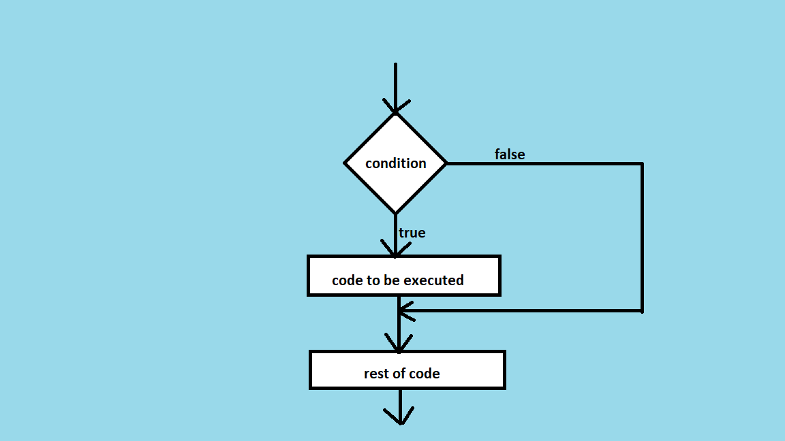
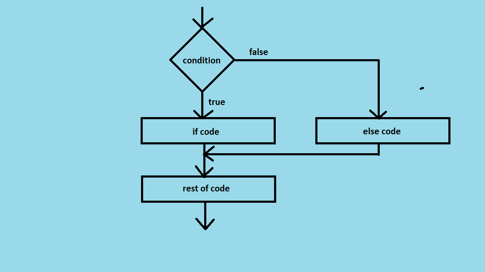
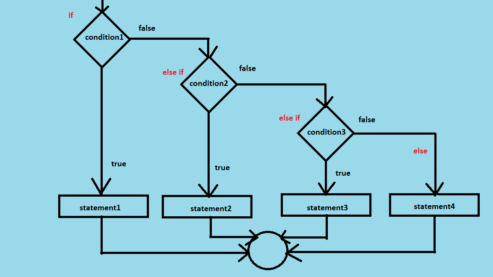
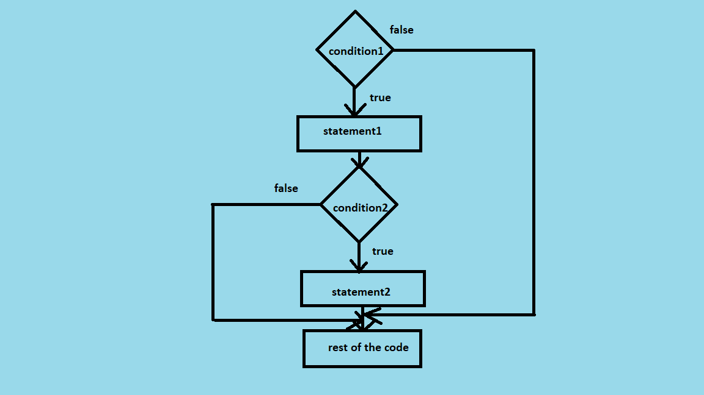

> # If Statement In Java:

The if statement is used to test the condition. It checks boolean condition: true or false.

> ## Types Of If Statement:

- __if statement__:

    It executes the if block if condition is true.
    
    __Syntax:__
    ```java
    if(condition){ 

        //code to be executed 

    }  
    ```
    

- __if-else statement__:

     It executes the if block if condition is true otherwise else block is executed.
     
     __Syntax:__
     ```java
    if(condition){ 

        //code to be executed if condition is true

    }else{ 

        //code to be executed if condition is false  

    }   
    ```
    

- __if-else-if statement__:

    It executes one condition from multiple statements.

    __Syntax:__
    ```java
    if(condition1){ 

        //code to be executed if condition is true

    }else if(condition2){ 

        //code to be executed if condition2 is true 

    }else if(condition3){

        //code to be executed if condition3 is true

    }
    ...
    else{

        //code to be executed if all conditions are flase

    } 
    ```
    

- __Nested if statement__:
    It represents the if block within another if block. Here, the inner-if block condition executes only when outer-if block condition is true.
    __Synatx:__
    ```java
    if(condition1A){

        //code to be executed if condition1A is true.

          if(condition1B){ 

             //code to be executed  if condition1B is true.

                if(condition1C){

                    //code to be executed if condition1C is true.

                    //you can use multiple if statment inside if statemnet

                }

        }

    }  
    ```
    